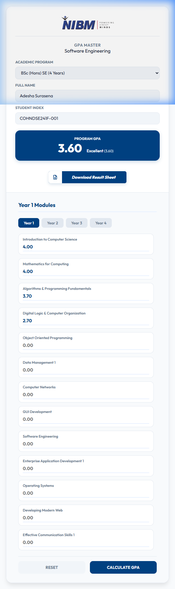
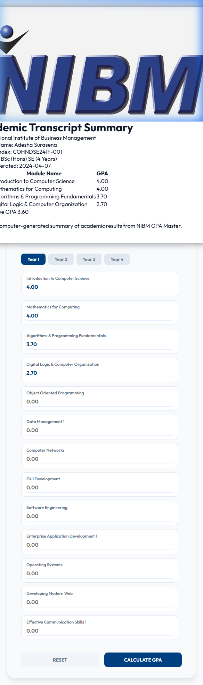

# NIBM-GPA-Calculator

NIBM GPA Master is a professional-grade cumulative GPA calculator designed for NIBM Software Engineering students. It supports the full 4-year academic pathway, from Diploma through Higher National Diploma to the final Degree.

## Features

- **Full Academic Pathway**: Includes specific modules for Year 1 (Diploma), Years 1 & 2 (HND), and Years 1-4 (BSc Hons).
- **Cumulative Calculation**: Implements a true cumulative GPA logic across all enrolled modules and academic years.
- **Student Identity**: Support for Student Name and Index Number tracking.
- **Professional PDF Reports**: Generates formal academic transcript summaries suitable for print or digital export.
- **Minimalist Academic UI**: A clean, white and blue themed interface optimized for efficiency and readability.

## Screenshots

### Application Interface

### Academic Transcript Summary (PDF Report)

## Usage

1. **Select Program**: Choose your current academic program (Diploma, HND, or Degree) from the sidebar.
2. **Identity**: Enter your Full Name and Student Index for the formal report.
3. **Module Input**: Navigate through the Year tabs and select your earned grades for each module.
4. **Calculate**: Click the 'Calculate GPA' button to view your cumulative result and performance badge.
5. **Export**: Click 'Download Result Sheet' to generate a print-ready transcript summary in PDF format.

## Technology Stack

- HTML5 (Semantic Structure)
- CSS3 (Vanilla Design System & Print Media Queries)
- JavaScript (State Management & Calculation Logic Logic)
- Vercel (Cloud Deployment)
